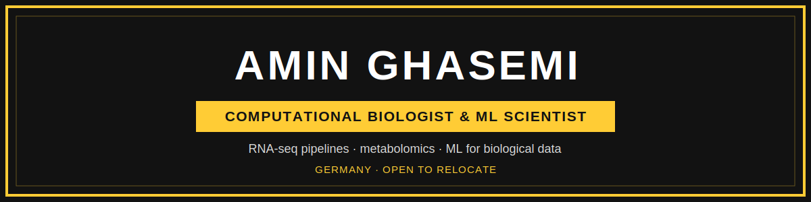
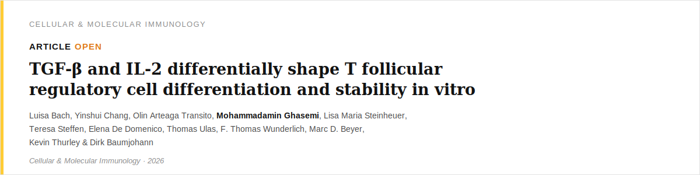
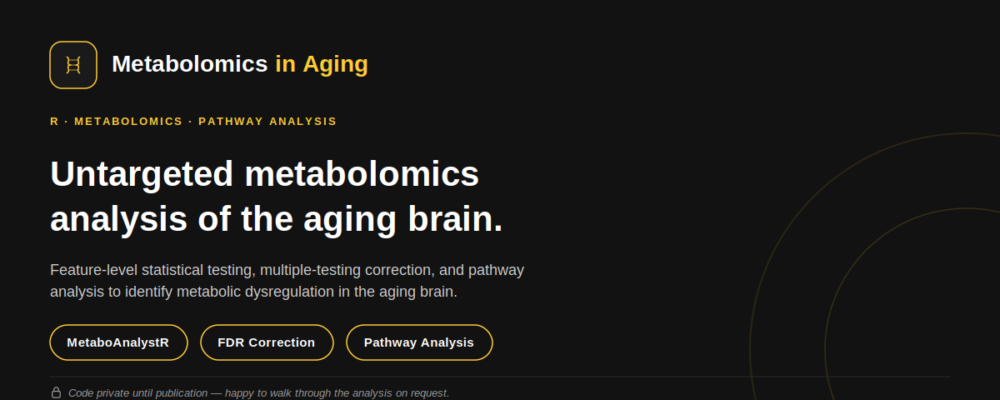
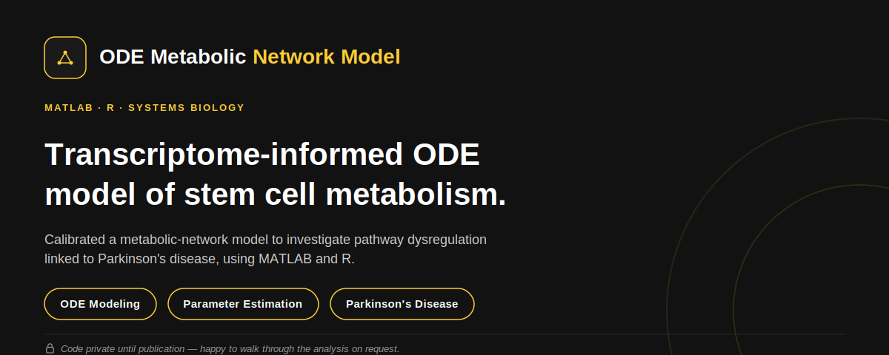
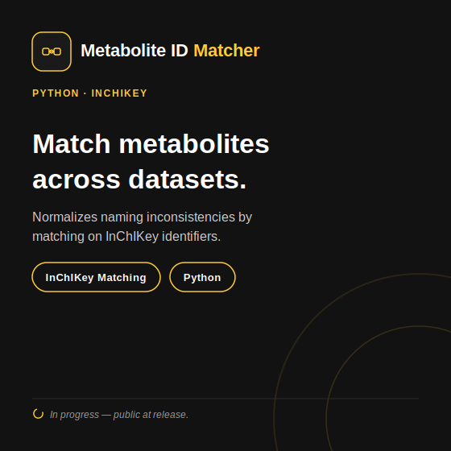
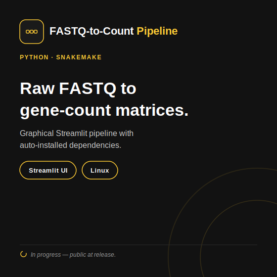

<p align="center">
  
</p>

<p align="center">
  <a href="https://linkedin.com/in/maminghasemi"></a>
  <a href="https://scholar.google.com/citations?user=cu2FwSMAAAAJ&hl=en&authuser=1"></a>
  <a href="mailto:amings@uni-bonn.de"></a>
</p>

<br>

## 📄 Featured Publication

<a href="https://www.nature.com/articles/s41423-026-01440-9">
  
</a>

<br><br>

## 🎓 PhD Thesis Projects



<br>



<br>

## 🚧 Currently Building

<table>
<tr>
<td width="50%"></td>
<td width="50%"></td>
</tr>
</table>

<br>

## 👨‍💻 About Me

```js
const amin = {
  location: "Bonn, Germany",
  role: "Bioinformatics & Biostatistics | Multiomics Data Analysis",
  background: "PhD Candidate, Experimental Medicine (Univ. of Bonn)",

  focus: [
    "Bulk & single-cell RNA-seq",
    "Untargeted metabolomics",
    "ODE-based metabolic network modeling",
    "ML for biomedical classification",
  ],

  languages: ["Python", "R", "MATLAB"],

  currentGoal: "Preparing for my PhD defense — while expanding into Bioinformatics & AI Engineering",

  extra: "Product design background — helps me turn analysis into something people can actually use",
};
```

---

## 🛠️ Tools & Stack

[](#)
[](#)
[](#)
[](#)
[](#)
[](#)

[](#)
[](#)
[](#)
[](#)
[](#)

---

## 🚀 Current Focus

- Preparing for my PhD defense (Experimental Medicine, University of Bonn)
- Expanding my skills in Bioinformatics and AI Engineering
- Building reproducible pipelines for omics data analysis

---

## 📷 Beyond the Lab

- Traveling, photography & videography
- Drone photography
